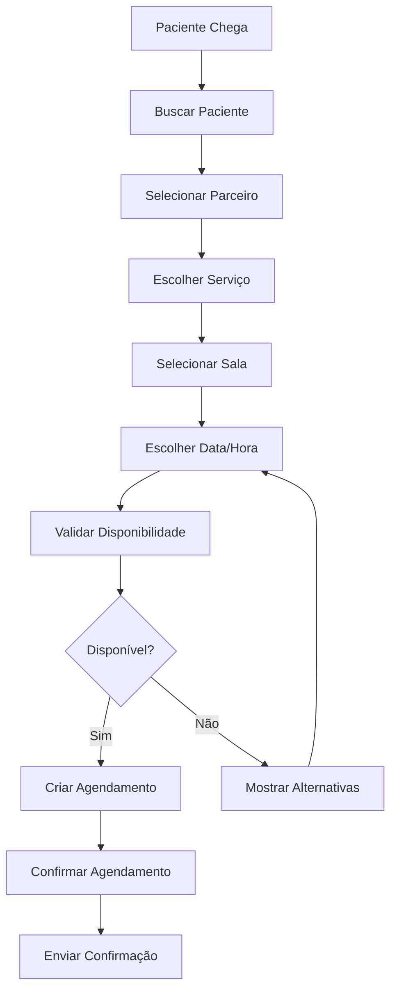
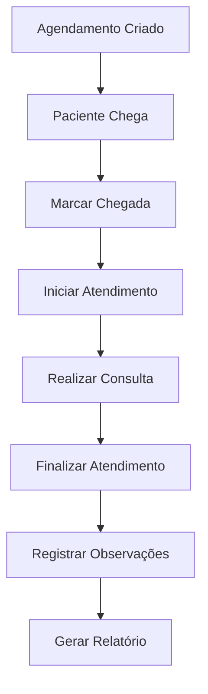
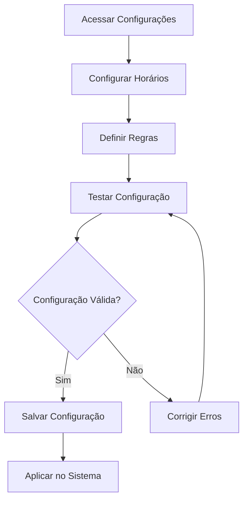

# Documentação de Funcionalidades - Clínica Essencial

## 📋 Visão Geral

Esta documentação detalha todas as funcionalidades implementadas no sistema da Clínica Essencial, incluindo fluxos de trabalho, regras de negócio e interfaces de usuário.

**Versão**: 2.2.0  
**Última Atualização**: Janeiro 2025  
**Sistema**: Clínica Essencial Frontend

---

## 🏥 Módulo de Agendamentos

### 1. Visão Geral do Sistema

O módulo de agendamentos é o coração do sistema, permitindo o gerenciamento completo de consultas e procedimentos médicos.

#### Funcionalidades Principais:
- ✅ **Agendamento de Consultas** - Criação e edição
- ✅ **Calendário Interativo** - Visualização mensal/semanal
- ✅ **Agenda por Salas** - Drag & drop entre consultórios
- ✅ **Validações Inteligentes** - Conflitos e disponibilidade
- ✅ **Gestão de Status** - Controle de ciclo de vida
- ✅ **Relatórios** - Estatísticas e análises

### 2. Novo Agendamento

#### Localização: `src/pages/agendamentos/novo.tsx`

**Fluxo de Criação:**
1. **Seleção de Paciente** → Busca e seleção
2. **Seleção de Parceiro** → Filtro por especialidade
3. **Seleção de Serviço** → Baseado no parceiro
4. **Seleção de Sala** → Baseada no serviço
5. **Data e Horário** → Validação de disponibilidade
6. **Configurações** → Primeira consulta, preparo, etc.
7. **Confirmação** → Revisão e salvamento

#### Validações Implementadas:
```typescript
// Validações temporais
- Data não pode ser passada (com tolerância de 1 hora)
- Horário deve estar dentro da disponibilidade do parceiro
- Não pode haver conflitos de horário

// Validações de negócio
- Parceiro deve ter especialidade compatível
- Serviço deve estar disponível para agendamento
- Sala deve aceitar o tipo de serviço
```

#### Interface Principal:
```typescript
interface NovoAgendamentoForm {
  pacienteId: number          // Obrigatório
  parceiroId: number          // Obrigatório
  servicoId: number           // Obrigatório
  salaId: number             // Obrigatório
  data: string               // YYYY-MM-DD
  horaInicio: string         // HH:MM
  duracaoMinutos: number     // Baseado no serviço
  valorServico: number       // Calculado automaticamente
  valorParceiro: number      // Configurável
  observacoes: string        // Opcional
  primeiraConsulta: boolean  // Checkbox
  requerPreparo: boolean     // Checkbox
  instrucoesPreparo: string  // Se requer preparo
}
```

### 3. Edição de Agendamento

#### Localização: `src/pages/agendamentos/editar.tsx`

**Funcionalidades:**
- ✅ **Edição Completa** - Todos os campos editáveis
- ✅ **Validação de Conflitos** - Exclui próprio agendamento
- ✅ **Histórico de Mudanças** - Rastreamento de alterações
- ✅ **Reagendamento** - Mover para nova data/hora
- ✅ **Cancelamento** - Com motivo obrigatório

#### Regras de Edição:
```typescript
// Agendamentos passados
- Permite edição com tolerância de 1 hora
- Bloqueia edição após tolerância
- Permite cancelamento sempre

// Agendamentos futuros
- Edição livre (com validações)
- Reagendamento com validação de disponibilidade
- Cancelamento com motivo obrigatório
```

### 4. Calendário de Agendamentos

#### Localização: `src/pages/agendamentos/calendario.tsx`

**Tecnologia:** FullCalendar 6.1.15

#### Funcionalidades:
- ✅ **Visualização Mensal/Semanal** - Múltiplas views
- ✅ **Drag & Drop** - Mover agendamentos
- ✅ **Filtro por Sala** - Visualizar por consultório
- ✅ **Detalhes do Evento** - Modal com informações
- ✅ **Navegação Intuitiva** - Anterior/próximo
- ✅ **Responsivo** - Mobile-friendly

#### Configurações do Calendário:
```typescript
const calendarConfig = {
  plugins: [dayGridPlugin, timeGridPlugin, interactionPlugin],
  initialView: "dayGridMonth",
  height: 500,
  locale: ptLocale,
  editable: true,
  selectable: true,
  eventDrop: handleEventDrop,
  eventClick: handleEventClick,
  datesSet: handleDatesSet
}
```

#### Validações de Drag & Drop:
```typescript
// Regras implementadas
- Não permite mover para datas passadas
- Valida disponibilidade do parceiro
- Verifica conflitos de horário
- Respeita configurações de horários da clínica
- Valida especialidades da sala de destino
```

### 5. Agenda por Salas

#### Localização: `src/pages/agendamentos/horarios.tsx`

**Funcionalidades Avançadas:**
- ✅ **Drag & Drop Entre Salas** - Mover agendamentos
- ✅ **Validação por Especialidade** - Controle de compatibilidade
- ✅ **Feedback Visual** - Indicadores de validação
- ✅ **Múltiplos Períodos** - Manhã/tarde configuráveis
- ✅ **Modal de Detalhes** - Informações completas

#### Especialidades por Sala:
```typescript
const especialidadesPorSala = {
  1: ['Medicina Funcional', 'Clínica Geral', 'Cardiologia', 'Endocrinologia'],
  2: ['Acupuntura', 'Massagem', 'Fisioterapia', 'Quiropraxia'],
  3: ['Medicina Funcional', 'Pediatria', 'Dermatologia', 'Ginecologia'],
  4: ['Psicologia', 'Psiquiatria', 'Terapia Familiar', 'Neuropsicologia'],
  5: ['Estética', 'Nutrição', 'Coaching', 'Terapias Integrativas']
}
```

#### Validações de Movimento:
```typescript
// Validações implementadas
- Parceiro deve ter especialidade compatível com a sala
- Não pode haver conflitos de horário
- Data de destino deve estar dentro da disponibilidade
- Agendamentos passados requerem confirmação
```

### 6. Lista de Agendamentos

#### Localização: `src/pages/agendamentos/lista.tsx`

**Funcionalidades:**
- ✅ **Listagem Paginada** - Performance otimizada
- ✅ **Filtros Avançados** - Data, parceiro, status, etc.
- ✅ **Busca por Texto** - Nome do paciente, observações
- ✅ **Ações em Lote** - Múltipla seleção
- ✅ **Exportação** - Dados para relatórios
- ✅ **Status Management** - Controle de ciclo de vida

#### Filtros Disponíveis:
```typescript
interface FiltrosAgendamento {
  dataInicio: string
  dataFim: string
  parceiroId: number
  salaId: number
  status: StatusAgendamento[]
  pacienteNome: string
  primeiraConsulta: boolean
  requerPreparo: boolean
}
```

#### Status de Agendamento:
```typescript
type StatusAgendamento = 
  | 'agendado'      // Status inicial
  | 'confirmado'    // Paciente confirmou
  | 'em_andamento'  // Atendimento iniciado
  | 'concluido'     // Atendimento finalizado
  | 'cancelado'     // Agendamento cancelado
  | 'nao_compareceu' // Paciente não compareceu
```

---

## 👥 Módulo de Pacientes

### 1. Gestão de Pacientes

#### Localização: `src/pages/pacientes/`

**Funcionalidades Principais:**
- ✅ **Cadastro Completo** - Dados pessoais e médicos
- ✅ **Histórico de Agendamentos** - Timeline de atendimentos
- ✅ **Busca Avançada** - Múltiplos critérios
- ✅ **Cadastro Rápido** - Modal para agendamentos
- ✅ **Edição de Dados** - Atualização de informações

### 2. Formulário de Paciente

#### Localização: `src/pages/pacientes/form.tsx`

**Campos do Formulário:**
```typescript
interface PacienteForm {
  // Dados Pessoais
  nome: string
  email: string
  telefone: string
  cpf: string
  dataNascimento: string
  genero: 'masculino' | 'feminino' | 'outro'
  
  // Endereço
  cep: string
  endereco: string
  numero: string
  complemento: string
  bairro: string
  cidade: string
  estado: string
  
  // Dados Médicos
  altura: number
  peso: number
  tipoSanguineo: string
  alergias: string
  medicamentos: string
  condicoesMedicas: string
  
  // Contato de Emergência
  contatoEmergencia: {
    nome: string
    telefone: string
    relacionamento: string
  }
  
  // Observações
  observacoes: string
  ativo: boolean
}
```

#### Validações:
```typescript
// Validações implementadas
- CPF válido e único
- Email válido e único
- Telefone no formato brasileiro
- CEP válido (integração com API)
- Data de nascimento válida
- Campos obrigatórios
```

### 3. Lista de Pacientes

#### Localização: `src/pages/pacientes/index.tsx`

**Funcionalidades:**
- ✅ **Listagem Paginada** - Performance otimizada
- ✅ **Busca por Nome/CPF** - Busca rápida
- ✅ **Filtros Avançados** - Status, cidade, etc.
- ✅ **Ações Rápidas** - Editar, visualizar histórico
- ✅ **Exportação** - Lista para relatórios
- ✅ **Status Ativo/Inativo** - Controle de cadastro

#### Filtros Disponíveis:
```typescript
interface FiltrosPaciente {
  nome: string
  cpf: string
  email: string
  cidade: string
  estado: string
  ativo: boolean
  dataCadastroInicio: string
  dataCadastroFim: string
}
```

---

##‍⚕️ Módulo de Parceiros

### 1. Gestão de Parceiros

#### Localização: `src/pages/parceiros/`

**Funcionalidades Principais:**
- ✅ **Cadastro Completo** - Dados profissionais
- ✅ **Especialidades** - Múltiplas especialidades
- ✅ **Disponibilidade** - Configuração de agenda
- ✅ **Serviços Habilitados** - Controle de serviços
- ✅ **Documentação** - Upload de documentos

### 2. Formulário de Parceiro

#### Localização: `src/pages/parceiros/form.tsx`

**Campos do Formulário:**
```typescript
interface ParceiroForm {
  // Dados Pessoais
  nomeCompleto: string
  email: string
  telefone: string
  cpf: string
  dataNascimento: string
  
  // Dados Profissionais
  especialidades: string[]
  registroProfissional: string
  formacao: string
  experiencia: number
  
  // Serviços
  servicosHabilitados: number[]
  
  // Disponibilidade
  disponibilidade: DisponibilidadeParceiro
  
  // Dados Bancários
  dadosBancarios: {
    banco: string
    agencia: string
    conta: string
    tipoConta: 'corrente' | 'poupanca'
  }
  
  // Documentação
  documentos: {
    cpf: File
    registroProfissional: File
    curriculo: File
  }
  
  // Observações
  observacoes: string
  ativo: boolean
}
```

### 3. Configuração de Disponibilidade

#### Localização: `src/pages/parceiros/disponibilidade.tsx`

**Funcionalidades:**
- ✅ **Interface Visual** - Configuração intuitiva
- ✅ **Múltiplos Períodos** - Manhã/tarde/noite
- ✅ **Dias da Semana** - Configuração individual
- ✅ **Horários Flexíveis** - Início e fim personalizáveis
- ✅ **Validação de Horários** - Início antes do fim

#### Estrutura de Disponibilidade:
```typescript
interface DisponibilidadeParceiro {
  segunda: {
    ativo: boolean
    horarios: Array<{
      inicio: string  // "09:00"
      fim: string     // "17:00"
    }>
  }
  terca: { /* mesma estrutura */ }
  quarta: { /* mesma estrutura */ }
  quinta: { /* mesma estrutura */ }
  sexta: { /* mesma estrutura */ }
  sabado: { /* mesma estrutura */ }
  domingo: { /* mesma estrutura */ }
}
```

---

## 🏥 Módulo de Salas

### 1. Gestão de Salas

#### Localização: `src/pages/salas/`

**Funcionalidades:**
- ✅ **Cadastro de Consultórios** - Dados completos
- ✅ **Especialidades por Sala** - Controle de atendimento
- ✅ **Status de Disponibilidade** - Ativo/Inativo
- ✅ **Configuração de Equipamentos** - Recursos disponíveis

### 2. Formulário de Sala

#### Localização: `src/pages/salas/form.tsx`

**Campos do Formulário:**
```typescript
interface SalaForm {
  nome: string
  descricao: string
  tipo: 'consultorio' | 'sala_procedimento' | 'sala_massagem' | 'sala_espera'
  capacidade: number
  especialidades: string[]
  equipamentos: string[]
  observacoes: string
  ativo: boolean
}
```

#### Tipos de Sala:
```typescript
const tiposSala = {
  consultorio: 'Consultório Médico',
  sala_procedimento: 'Sala de Procedimento',
  sala_massagem: 'Sala de Massagem',
  sala_espera: 'Sala de Espera'
}
```

---

## 🛍️ Módulo de Produtos/Serviços

### 1. Gestão de Produtos e Serviços

#### Localização: `src/pages/produtos/`

**Funcionalidades:**
- ✅ **Catálogo Completo** - Produtos e serviços
- ✅ **Categorização** - Organização por categorias
- ✅ **Preços Dinâmicos** - Valores configuráveis
- ✅ **Duração Configurável** - Tempo de atendimento
- ✅ **Disponibilidade** - Controle de oferta

### 2. Formulário de Produto/Serviço

#### Localização: `src/pages/produtos/ProdutoForm.tsx`

**Campos do Formulário:**
```typescript
interface ProdutoForm {
  // Dados Básicos
  nome: string
  descricao: string
  tipo: 'produto' | 'servico'
  categoriaId: number
  
  // Preços
  precoCusto: number
  precoVenda: number
  margemLucro: number
  
  // Serviços (se aplicável)
  duracaoMinutos: number
  disponivelAgendamento: boolean
  requerPreparo: boolean
  instrucoesPreparo: string
  
  // Produtos (se aplicável)
  codigoBarras: string
  estoque: number
  estoqueMinimo: number
  unidadeMedida: string
  
  // Configurações
  ativo: boolean
  destaque: boolean
  observacoes: string
}
```

### 3. Lista de Produtos/Serviços

#### Localização: `src/pages/produtos/ProdutosLista.tsx`

**Funcionalidades:**
- ✅ **Listagem Paginada** - Performance otimizada
- ✅ **Filtros por Tipo** - Produtos vs Serviços
- ✅ **Busca por Nome** - Busca rápida
- ✅ **Filtros por Categoria** - Organização
- ✅ **Controle de Estoque** - Para produtos
- ✅ **Status Ativo/Inativo** - Controle de oferta

---

## ⚙️ Módulo de Configurações

### 1. Configuração de Horários

#### Localização: `src/pages/configuracoes/horarios.tsx`

**Funcionalidades:**
- ✅ **Configuração por Dia** - Segunda a Domingo
- ✅ **Múltiplos Períodos** - Manhã/tarde/noite
- ✅ **Validação de Horários** - Início antes do fim
- ✅ **Ativar/Desativar Dias** - Controle flexível
- ✅ **Interface Visual** - Configuração intuitiva

#### Estrutura de Configuração:
```typescript
interface HorariosFuncionamento {
  segunda: {
    ativo: boolean
    periodos: Array<{
      inicio: string  // "08:00"
      fim: string     // "12:00"
    }>
  }
  terca: { /* mesma estrutura */ }
  quarta: { /* mesma estrutura */ }
  quinta: { /* mesma estrutura */ }
  sexta: { /* mesma estrutura */ }
  sabado: { /* mesma estrutura */ }
  domingo: { /* mesma estrutura */ }
}
```

#### Validações:
```typescript
// Validações implementadas
- Formato de hora válido (HH:MM)
- Início deve ser anterior ao fim
- Pelo menos um período por dia ativo
- Máximo de 3 períodos por dia
```

### 2. Regras de Agendamento

#### Localização: `src/pages/configuracoes/regras-agendamento.tsx`

**Configurações Disponíveis:**
```typescript
interface ConfiguracaoAgendamentos {
  intervaloSlots: number           // 15-120 minutos
  antecedenciaMinima: number       // 0+ minutos
  antecedenciaMaxima: number       // 1+ dias
  permitirAgendamentoPassado: boolean
  toleranciaEdicaoPassado: number  // minutos
  permitirMoverConcluido: boolean
  permitirMoverCancelado: boolean
}
```

#### Funcionalidades:
- ✅ **Intervalo de Slots** - Configuração de horários
- ✅ **Antecedência** - Mínima e máxima
- ✅ **Tolerância** - Para edições passadas
- ✅ **Permissões** - Controle de movimentação
- ✅ **Validação de Regras** - Aplicação automática

### 3. Teste de Horários

#### Localização: `src/pages/configuracoes/teste-horarios.tsx`

**Funcionalidades:**
- ✅ **Teste em Tempo Real** - Validação de configurações
- ✅ **Geração de Horários** - Baseado na data
- ✅ **Visualização de Slots** - Horários disponíveis
- ✅ **Feedback de Configuração** - Validação de regras

---

## 📊 Módulo de Relatórios

### 1. Dashboard Principal

#### Localização: `src/pages/dashboard/`

**Widgets Disponíveis:**
- ✅ **Agendamentos do Dia** - Visão geral
- ✅ **Pacientes Ativos** - Métricas de engajamento
- ✅ **Faturamento Mensal** - Análise financeira
- ✅ **Ocupação de Salas** - Eficiência operacional
- ✅ **Gráficos Interativos** - ApexCharts

### 2. Estatísticas de Agendamentos

#### Funcionalidades:
- ✅ **Período Personalizável** - Data início/fim
- ✅ **Filtros por Parceiro** - Análise individual
- ✅ **Filtros por Sala** - Análise por consultório
- ✅ **Status de Agendamentos** - Distribuição
- ✅ **Exportação de Dados** - Relatórios

#### Métricas Disponíveis:
```typescript
interface EstatisticasAgendamento {
  totalAgendamentos: number
  agendamentosConfirmados: number
  agendamentosRealizados: number
  agendamentosCancelados: number
  taxaConfirmacao: number
  taxaComparecimento: number
  faturamentoTotal: number
  faturamentoMedio: number
  ocupacaoSalas: number
  tempoMedioAtendimento: number
}
```

### 3. Relatórios de Pacientes

#### Funcionalidades:
- ✅ **Novos Pacientes** - Cadastros por período
- ✅ **Pacientes Ativos** - Engajamento
- ✅ **Distribuição Geográfica** - Por cidade/estado
- ✅ **Histórico de Atendimentos** - Timeline
- ✅ **Análise de Retenção** - Fidelização

---

## 🔐 Módulo de Autenticação

### 1. Sistema de Login

#### Localização: `src/pages/auth/`

**Funcionalidades:**
- ✅ **Login Seguro** - JWT Token
- ✅ **Lembrança de Senha** - "Lembrar-me"
- ✅ **Redirecionamento** - Página anterior
- ✅ **Validação de Formulário** - Zod schemas
- ✅ **Feedback de Erro** - Mensagens claras

### 2. Controle de Acesso

#### Funcionalidades:
- ✅ **Rotas Protegidas** - Autenticação obrigatória
- ✅ **Controle de Permissões** - Role-based access
- ✅ **Sessão Persistente** - LocalStorage
- ✅ **Logout Seguro** - Limpeza de dados
- ✅ **Timeout de Sessão** - Segurança

---

## 📱 Responsividade e UX

### 1. Design Responsivo

#### Breakpoints Implementados:
```css
/* Mobile First */
.sm: 640px   /* Tablets pequenos */
.md: 768px   /* Tablets */
.lg: 1024px  /* Desktops pequenos */
.xl: 1280px  /* Desktops */
.2xl: 1536px /* Desktops grandes */
```

#### Adaptações por Dispositivo:
- ✅ **Mobile** - Layout otimizado para touch
- ✅ **Tablet** - Interface intermediária
- ✅ **Desktop** - Layout completo com sidebar
- ✅ **Grande Tela** - Aproveitamento de espaço

### 2. Experiência do Usuário

#### Padrões Implementados:
- ✅ **Feedback Visual** - Loading states, toasts
- ✅ **Validação em Tempo Real** - Formulários
- ✅ **Navegação Intuitiva** - Breadcrumbs, menus
- ✅ **Acessibilidade** - ARIA labels, keyboard navigation
- ✅ **Performance** - Lazy loading, otimizações

#### Componentes de Feedback:
```typescript
// Toast notifications
toast.success('Agendamento criado com sucesso!')
toast.error('Erro ao criar agendamento')
toast.loading('Carregando dados...')

// Loading states
const [loading, setLoading] = useState(false)

// Modal feedback
const [modalFeedback, setModalFeedback] = useState({
  open: false,
  titulo: '',
  mensagem: '',
  tipo: 'info'
})
```

---

## 🔄 Integração com Backend

### 1. API Endpoints

#### Agendamentos:
```typescript
GET    /api/agendamentos              // Listar
POST   /api/agendamentos              // Criar
GET    /api/agendamentos/:id          // Buscar
PUT    /api/agendamentos/:id          // Atualizar
DELETE /api/agendamentos/:id          // Excluir
GET    /api/agendamentos/calendario   // Eventos do calendário
POST   /api/agendamentos/verificar-disponibilidade
PATCH  /api/agendamentos/:id/marcar-chegada
PATCH  /api/agendamentos/:id/iniciar-atendimento
PATCH  /api/agendamentos/:id/finalizar-atendimento
PATCH  /api/agendamentos/:id/cancelar
```

#### Configurações:
```typescript
GET    /api/configuracoes/horarios-funcionamento
PUT    /api/configuracoes/horarios-funcionamento
POST   /api/configuracoes/gerar-horarios
GET    /api/configuracoes/agendamentos
PUT    /api/configuracoes/agendamentos
```

### 2. Tratamento de Erros

#### Padrão de Resposta:
```typescript
interface ApiResponse<T> {
  success: boolean
  data: T
  message: string
  errors?: Record<string, string[]>
}
```

#### Tratamento de Erros:
```typescript
// Interceptor de erro
api.interceptors.response.use(
  (response) => response,
  (error) => {
    if (error.response?.status === 401) {
      // Redirecionar para login
      window.location.href = '/auth/signin'
    }
    
    if (error.response?.status === 400) {
      // Parse de erro detalhado
      const erro = JSON.parse(error.response)
      if (erro.message) {
        toast.error(erro.message)
      }
    }
    
    return Promise.reject(error)
  }
)
```

---

## �� Fluxos de Trabalho

### 1. Fluxo de Agendamento



### 2. Fluxo de Atendimento



### 3. Fluxo de Configuração



---

## 📋 Checklist de Funcionalidades

### ✅ Módulo de Agendamentos
- [x] Criação de agendamentos
- [x] Edição de agendamentos
- [x] Calendário interativo
- [x] Agenda por salas
- [x] Validações de conflito
- [x] Controle de status
- [x] Relatórios

### ✅ Módulo de Pacientes
- [x] Cadastro completo
- [x] Edição de dados
- [x] Busca avançada
- [x] Histórico de atendimentos
- [x] Cadastro rápido

### ✅ Módulo de Parceiros
- [x] Cadastro profissional
- [x] Configuração de especialidades
- [x] Configuração de disponibilidade
- [x] Controle de serviços
- [x] Upload de documentos

### ✅ Módulo de Salas
- [x] Cadastro de consultórios
- [x] Configuração de especialidades
- [x] Controle de status
- [x] Gestão de equipamentos

### ✅ Módulo de Produtos/Serviços
- [x] Catálogo completo
- [x] Categorização
- [x] Controle de preços
- [x] Configuração de duração
- [x] Controle de estoque

### ✅ Módulo de Configurações
- [x] Horários de funcionamento
- [x] Regras de agendamento
- [x] Teste de configurações
- [x] Validação de regras

### ✅ Sistema de Relatórios
- [x] Dashboard principal
- [x] Estatísticas de agendamentos
- [x] Relatórios de pacientes
- [x] Análise financeira

### ✅ Autenticação e Segurança
- [x] Sistema de login
- [x] Controle de acesso
- [x] Rotas protegidas
- [x] Sessão segura

---

## �� Próximas Funcionalidades

### Planejadas para Próximas Versões:
- 🔄 **Notificações Push** - Lembretes automáticos
- 🔄 **Integração com WhatsApp** - Confirmações via mensagem
- 🔄 **Sistema de Pagamentos** - Integração com gateways
- �� **Prontuário Eletrônico** - Histórico médico completo
- �� **Telemedicina** - Consultas online
- 🔄 **App Mobile** - Versão para smartphones
- 🔄 **Integração com Planos de Saúde** - Autorizações automáticas
- �� **Sistema de Fidelidade** - Pontos e recompensas

---

**Última Atualização**: Janeiro 2025  
**Versão da Documentação**: 1.0.0  
**Sistema**: Clínica Essencial Frontend v2.2.0 